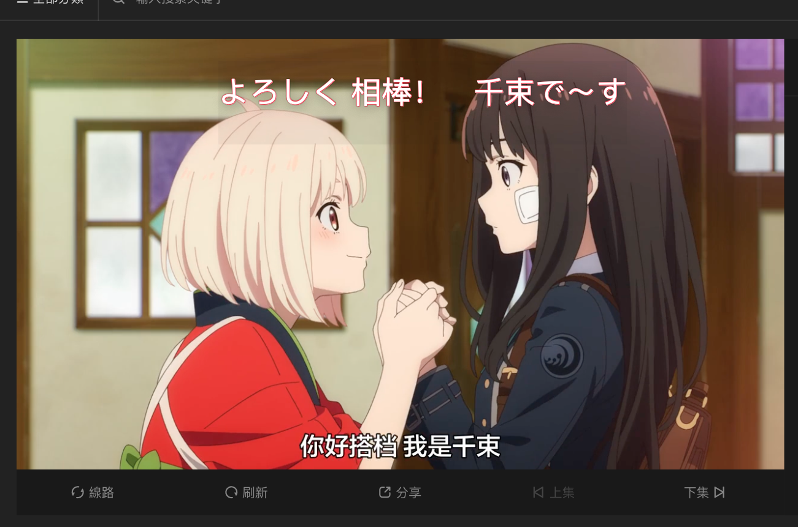

# Foobar

subtitle-player is a java GUI Application for play subtitle independent.

## Required
jdk 17

## Usage

```shell
 ./mvnw spring-boot:run
```

## screenshot


## Contributing
Pull requests are welcome. For major changes, please open an issue first to discuss what you would like to change.

Please make sure to update tests as appropriate.

## License
[MIT](https://choosealicense.com/licenses/mit/)